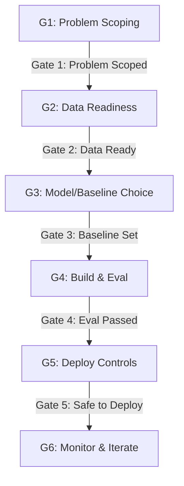

# Day 02 - Xác Định Bài Toán Kinh Doanh Cho AI

Tài liệu này hệ thống hóa toàn bộ kiến thức của **Day 02: Xác Định Bài Toán Kinh Doanh Cho AI**. Việc chọn đúng bài toán, đúng mức độ tự động hóa và thiết lập ranh giới vận hành là yếu tố sống còn quyết định sự thành bại của dự án AI.

---

## 1. Bản Chất Quy Trình & 4 Câu Hỏi Chiến Lược

Trước khi đầu tư bất kỳ nguồn lực nào vào phát triển AI, đội ngũ dự án cần tự trả lời bốn câu hỏi lớn sau:
1.  **Bài toán có thực sự cần AI giải quyết?** (Hay có thể xử lý tốt bằng quy tắc cứng/code truyền thống?)
2.  **Nếu có, giải pháp ở cấp độ nào?** (Rule engine, Workflow tĩnh, hay Agent tự trị?)
3.  **Problem Statement đã đủ rõ ràng để triển khai?**
4.  **Khi nào quyết định: Go, Not Yet, hay No-Go?** (Dựa trên Gate Criteria)

---

## 2. 6 Giai Đoạn Phát Triển AI Product & Gate Criteria

Quy trình phát triển một sản phẩm AI không tuyến tính như phần mềm thông thường mà được chia thành các cổng duyệt chất lượng nghiêm ngặt:



### Chi tiết các giai đoạn:
1.  **Giai đoạn 1: Problem Scoping (Xác định bài toán)**
    *   *Nội dung:* Làm rõ Actor, Current Workflow, Bottleneck, Impact, Metric và Boundary.
    *   *Bên tham gia:* Product Manager (PM) + AI Engineer (AI Eng).
    *   *Cổng duyệt (Gate):* Đi tiếp (**GO**) khi Problem Statement rõ ràng. Dừng lại (**NO-GO/NOT YET**) nếu đề bài mơ hồ, không rõ bài toán kinh doanh.
2.  **Giai đoạn 2: Data Readiness (Độ sẵn sàng của dữ liệu)**
    *   *Nội dung:* Khảo sát dữ liệu thô, logs hệ thống, tài liệu hướng dẫn và sự hỗ trợ từ chuyên gia ngành (SME).
    *   *Bên tham gia:* Data Team + Domain Expert (SME).
    *   *Cổng duyệt (Gate):* Đi tiếp khi có dữ liệu sạch, không thiên lệch, cấu trúc rõ ràng. Dừng lại nếu thiếu dữ liệu trầm trọng.
3.  **Giai đoạn 3: Baseline / Model Choice (Lựa chọn điểm chuẩn & mô hình)**
    *   *Nội dung:* Thiết lập mốc hiệu suất đối chứng (Heuristic/Human baseline) để đo đạc và chọn kiến trúc (Rule, Workflow, RAG, Agent).
    *   *Bên tham gia:* AI Engineer.
    *   *Cổng duyệt (Gate):* Đi tiếp khi đã đo xong hiệu suất hiện tại để biết AI cần phải vượt qua cái gì.
4.  **Giai đoạn 4: Build & Eval (Xây dựng & Đánh giá)**
    *   *Nội dung:* Lập trình và kiểm thử độc lập trên bộ dữ liệu test (test suite) để đo độ chính xác, độ trễ và chi phí.
    *   *Bên tham gia:* AI Engineer + QA.
5.  **Giai đoạn 5: Deploy Controls (Kiểm soát triển khai)**
    *   *Nội dung:* Cấu hình chốt chặn an toàn: Human-in-the-loop (HITL), phân quyền phê duyệt, ghi logs và phương án rollback.
    *   *Bên tham gia:* Platform Team + Risk Team.
6.  **Giai đoạn 6: Monitor & Iterate (Giám sát & Cải tiến)**
    *   *Nội dung:* Theo dõi sát sao chỉ số kỹ thuật lẫn chỉ số kinh doanh thực tế để tinh chỉnh mô hình qua vòng lặp phản hồi.
    *   *Bên tham gia:* Toàn bộ đội ngũ liên quan.

---

## 3. Khung Problem Statement Chuẩn Hóa

Một Problem Statement chuẩn chỉnh là cầu nối giữa bài toán kinh doanh và bộ đánh giá kỹ thuật. Nó bắt buộc phải chứa đầy đủ **6 cấu phần cốt lõi** sau:

> **Mẫu câu chuẩn:**
> *"**[Actor]** nào đang gặp **[Bottleneck]** nào trong **[Current Workflow]** nào, gây ra **[Impact]** gì, và thành công được đo bằng **[Success Metric]** nào với **[Operational Boundary]** ra sao?"*

1.  **Actor / Operator (Ai vận hành?):** Vai trò của người thực hiện công việc hàng ngày (ví dụ: Nhân viên chăm sóc khách hàng, Kiểm toán viên).
2.  **Current Workflow (Quy trình hiện tại?):** Mô tả chi tiết các bước xử lý thủ công và công cụ đang dùng.
3.  **Bottleneck (Điểm nghẽn ở đâu?):** Chỉ ra bước bị chậm, dễ sai sót hoặc tốn nhiều thời gian nhất.
4.  **Impact (Tổn thất là gì?):** Định lượng thiệt hại bằng tiền bạc, thời gian, tỷ lệ lỗi, hoặc việc vi phạm SLA.
5.  **Success Metric (Chỉ số thành công):** Ngưỡng mục tiêu cụ thể để nghiệm thu dự án (ví dụ: Giảm thời gian xử lý từ 8 phút xuống dưới 2 phút cho 80% trường hợp).
6.  **Operational Boundary (Ranh giới vận hành):** Quyền hạn của AI. AI được tự làm gì (autonomy) và điểm nào bắt buộc phải có con người kiểm duyệt (Human-in-the-loop - HITL).

---

## 4. 4 Anti-Patterns "Đốt Tiền" Vào AI
*   **Trend-first (Chạy theo xu hướng):** Lao vào xây dựng "AI Agent" trước khi xác định rõ ai là người dùng, quy trình ra sao và đo lường bằng gì.
*   **No baseline (Không có mốc đối chiếu):** Không có quy tắc cứng hay quy trình thủ công của người để so sánh, dẫn đến việc không chứng minh được AI có thực sự hiệu quả hơn cách cũ.
*   **No eval path (Không có bộ đánh giá chất lượng):** Chỉ làm demo nhìn đẹp mắt mà thiếu bộ test suite chuẩn chỉnh để đánh giá độ trễ, chi phí và độ chính xác trước khi deploy.
*   **No owner of failure (Không có người chịu trách nhiệm khi lỗi):** Không phân định rõ vai trò con người trong chuỗi vận hành khi AI đưa ra kết quả sai (ai duyệt, ai rollback, ai chịu trách nhiệm pháp lý).

---

## 5. AI-Fit Matrix: Ma Trận Lựa Chọn Giải Pháp

Khi chọn giải pháp, cần đặt bài toán vào hai chiều: **Độ mơ hồ của tác vụ (Task Ambiguity)** và **Độ phức tạp vận hành (Operational Complexity)**.

| Độ mơ hồ (Task Ambiguity) | Độ phức tạp vận hành | Kiến Trúc Khuyến Nghị | Đặc Điểm |
| :--- | :--- | :--- | :--- |
| **Thấp** (Rule rõ, quy tắc cứng) | **Thấp** (Ít bước, ít tùy biến) | **Rule / Script truyền thống** | Logic deterministic, yêu cầu chính xác 100% (ví dụ: Tính lãi suất tiết kiệm). |
| **Vừa phải** (Đầu vào biến thể) | **Vừa phải** (Có quy trình luồng) | **LLM Feature / Workflow có State** | Đầu vào ngôn ngữ tự nhiên nhưng luồng xử lý cố định (ví dụ: Tóm tắt bài viết, phân loại email). |
| **Cao** (Cần tự lên kế hoạch) | **Cao** (Nhiều bước, gọi nhiều tool) | **Agent có Controls / Guardrails** | Đòi hỏi lập kế hoạch động, tự chọn công cụ thích hợp (ví dụ: Trợ lý đặt phòng, lập lịch trình). |

*   **Nguyên tắc thực dụng:** Luôn ưu tiên bắt đầu bằng giải pháp đơn giản nhất (Rule/Workflow tĩnh), chỉ dịch chuyển sang Agent tự trị khi giá trị mang lại lớn hơn chi phí và độ phức tạp vận hành của nó.

---

## 6. Giải Phẫu Cấu Phần Hệ Thống AI (AI Feature/Agent Anatomy)

Một hệ thống AI hoàn chỉnh trong thực tế bao gồm **4 thành phần cốt lõi** xoay quanh bộ điều phối trung tâm (**Orchestrator**):

```
                       ┌─────────────────────────┐
                       │      Orchestrator       │
                       └─────┬─────────────┬─────┘
                             │             │
              ┌──────────────┴──────┐      ┌┴─────────────┐
              │ Model (LLM/SLM)     │      │ Context      │
              │ - Reasoning engine  │      │ - RAG        │
              │ - Hallucination risk│      │ - Memory     │
              └─────────────────────┘      └──────────────┘
              ┌──────────────┬──────┐      ┌┴─────────────┐
              │ Planning     │      │      │ Tools        │
              │ - Step limit │      │      │ - APIs       │
              │ - Policies   │      │      │ - Sandboxing │
              └──────────────┴──────┘      └──────────────┘
```

1.  **Model (LLM / SLM):** Bộ não suy luận dựa trên xác suất. Rủi ro: Ảo giác, không nhất quán. Kiểm soát bằng: Ép cấu trúc đầu ra (structured output), guardrails.
2.  **Context (RAG / Memory):** Không gian ngữ cảnh của model. Rủi ro: Lấy sai tài liệu, dữ liệu cũ. Kiểm soát bằng: Grounding checks, trích dẫn nguồn (citations).
3.  **Planning (Steps / Policies):** Khả năng lập kế hoạch nhiều bước. Rủi ro: Rơi vào vòng lặp vô hạn, chạy sai chính sách. Kiểm soát bằng: Giới hạn số bước tối đa (step limit), phê duyệt ở các bước nhạy cảm.
4.  **Tools (APIs / Actions):** Cổng tương tác với thế giới ngoài. Rủi ro: Gây tác dụng phụ lên hệ thống, lộ lọt dữ liệu (Prompt injection). Kiểm soát bằng: Sandbox cô lập, danh sách trắng (allowlist), Human-in-the-loop (HITL) cho hành động ghi/giao dịch.
