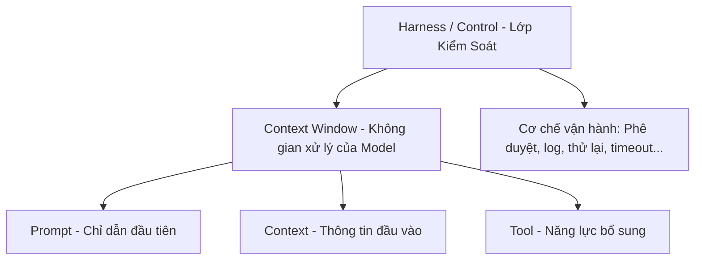

# Day 04 - Thiết Kế Prompt & Context Engineering

Tài liệu này hệ thống hóa toàn bộ kiến thức của **Day 04: Thiết Kế Prompt & Context Engineering**. Quản lý ngữ cảnh, lập cấu trúc prompt chuyên nghiệp, thiết kế ranh giới an toàn cho tool và hệ thống đánh giá là các kỹ năng cốt lõi để đưa ứng dụng AI vào vận hành thực tế.

---

## 1. Khái Niệm Context: Bàn Làm Việc Của Model

Model không chỉ đọc câu hỏi riêng lẻ của người dùng (User prompt), mà nó xử lý toàn bộ thông tin được cung cấp trong cửa sổ ngữ cảnh (Context Window).

> **Analogy:**
> **Context giống như một "Bàn làm việc của Model".** Prompt chỉ là tờ chỉ dẫn công việc đầu tiên. Chất lượng của kết quả đầu ra phụ thuộc vào toàn bộ tài liệu và công cụ được đặt lên chiếc bàn đó.

Một **Context Packet** (gói ngữ cảnh) được ứng dụng lắp ghép trước mỗi lượt gọi model bao gồm:
*   **System Prompt (Chỉ dẫn nền):** Vai trò, nhiệm vụ, giới hạn, tiêu chí và định dạng đầu ra.
*   **User Request:** Câu hỏi hoặc yêu cầu hiện tại của người dùng.
*   **Conversation History:** Lịch sử các lượt chat trước đó để giữ mạch hội thoại.
*   **Known Facts / State:** Dữ kiện đã biết về người dùng hoặc hệ thống (profile, cài đặt).
*   **Retrieved Docs / Policy (RAG):** Các tài liệu hoặc chính sách được tìm kiếm từ cơ sở dữ liệu.
*   **Tool Schemas:** Định nghĩa các công cụ mà model được phép dùng.
*   **Tool Results:** Kết quả phản hồi sau khi chạy công cụ (dữ liệu thô, thời điểm lấy, nguồn).
*   **Output Format / Eval Hints:** Các quy ước định dạng đầu ra và tiêu chí đánh giá câu trả lời.

---

## 2. Bản Đồ Các Lớp Của AI App (AI Application Layers)

Khi hệ thống AI hoạt động không đúng, ta cần xác định lỗi thuộc lớp nào trước khi chỉnh sửa. Không phải mọi lỗi đều bắt nguồn từ Prompt.

### Các lớp chính:
1.  **SYSTEM (Luật nền của App):** Vai trò, nguyên tắc xử lý, ràng buộc hệ thống và có mức ưu tiên cao hơn user.
2.  **USER (Yêu cầu ở lượt hiện tại):** Nội dung cần xử lý, câu hỏi hoặc dữ kiện của người dùng.
3.  **ASSISTANT (Phản hồi của Model):** Lịch sử các câu trả lời trước đó.
4.  **CONTROL / HARNESS (Lớp kiểm soát vận hành):** Cơ chế phê duyệt, kiểm thử, ghi log, thử lại (retry), quản lý giới hạn lỗi (timeout/fallback) ở tầng code ứng dụng.

---

## 3. Thiết Kế Cấu Trúc Prompt Chuyên Nghiệp

### 3.1. Phân biệt Prompt Template và Chat Template
*   **Prompt Template:** Do nhà phát triển viết ở tầng code để tạo ra nội dung của một message đơn lẻ (ví dụ: `"Lập kế hoạch cho {destination}, ngân sách {budget}"`).
*   **Chat Template:** Cách model/provider chuyển đổi danh sách các messages (`system` + `user` + `assistant` + `tool`) thành chuỗi tokens chuẩn để model hiểu cấu trúc cuộc hội thoại.

### 3.2. Các Khối Prompt Phổ Biến (Common Blocks)
*   `<system_role>`: Vai trò, chuyên môn, phong cách và phạm vi trách nhiệm.
*   `<instructions>`: Các quy tắc cụ thể (làm gì, không được làm gì, khi nào cần hỏi lại).
*   `<context>` / `<documents>`: Dữ liệu nền, tài liệu tham khảo hoặc kết quả truy xuất.
*   `<examples>`: Các ví dụ Few-shot mẫu để định hình kết quả đầu ra.
*   `<user_input>`: Yêu cầu thô từ người dùng.
*   `<output_format>`: Cấu trúc kết quả mong muốn (Markdown, JSON, Table).

### 3.3. Tầm Quan Trọng Của Delimiters (Ký tự phân tách)
*   **Tách instruction khỏi data:** Giúp model phân biệt rõ đâu là luật của ứng dụng và đâu là dữ liệu tham khảo.
*   **Cô lập input bên ngoài:** Bọc nội dung từ người dùng hoặc API trong các tag XML rõ ràng (ví dụ: `<user_query>`, `<external_content>`).
*   **Chỉ rõ phạm vi xử lý:** Yêu cầu model *"chỉ xử lý văn bản nằm trong tag `<target_text>`"*.
*   **Giữ cấu trúc nhất quán:** Dùng XML, Markdown hoặc JSON nhưng tránh trộn lẫn lộn xộn.

---

## 4. Boundary & Ask-If-Missing

*   **Boundary (Ranh giới hành vi):** Ngăn chặn model thực hiện các hành động vượt quá khả năng hoặc quyền hạn:
    *   Không tự bịa giá vé, phòng, hoặc chính sách dịch vụ.
    *   Không hứa đã đặt dịch vụ thành công khi chưa có mã xác nhận thực tế.
    *   Không tự ý tư vấn pháp lý hoặc y tế như một kết luận chắc chắn.
*   **Ask-if-missing (Hỏi lại khi thiếu thông tin quan trọng):** Nếu thiếu dữ kiện mang tính quyết định để thực thi hành động (**blocking** - ví dụ: thiếu ngày đi hoặc điểm khởi hành đối với app du lịch), model phải hỏi lại người dùng thay vì tự đưa ra giả định.
*   **Định dạng đầu ra tùy theo đối tượng nhận:**
    *   *Người dùng đọc (User):* Dùng định dạng thân thiện như Markdown, Bullets, Table, Citations.
    *   *Hệ thống xử lý (System):* Dùng định dạng có cấu trúc chặt chẽ như JSON/Schema, Enum, Required fields để hệ thống dễ parse và thực thi bước tiếp theo.

---

## 5. Thang Nâng Cấp Prompt (Prompt Scaffolding Ladder)

Hãy bắt đầu từ prompt đơn giản nhất, chỉ tăng độ phức tạp khi có bằng chứng thực tế cho thấy model cần thêm dữ liệu định hướng.

$$\text{Zero-shot} \longrightarrow \text{One-shot} \longrightarrow \text{Few-shot} \longrightarrow \text{Chain of Thought (CoT)} \longrightarrow \text{Tree of Thought (ToT)}$$

*   **Zero-shot:** Không đưa ví dụ. Phù hợp khi yêu cầu rõ ràng, nhiệm vụ đơn giản.
*   **One-shot:** Đưa 1 ví dụ mẫu. Thích hợp để định hình phong cách hoặc format phản hồi.
*   **Few-shot:** Đưa vài ví dụ mẫu. Thích hợp khi output có nhiều trường hợp đặc biệt dễ nhầm lẫn (edge cases).
    *   *Few-shot tồi:* Đưa ra các ví dụ y hệt nhau, ví dụ quá dài chứa giá cả giả định (gây tốn token và dạy model thói quen bịa thông tin), hoặc định dạng các ví dụ không đồng nhất.
    *   *Few-shot tốt:* Đưa ra các tình huống khác nhau (ví dụ: một trường hợp đủ thông tin, một trường hợp thiếu thông tin cần hỏi lại, một trường hợp cần gọi tool) với định dạng đầu ra chuẩn chỉnh.
*   **Chain of Thought (CoT):** Yêu cầu mô hình viết ra các bước suy luận trung gian trước khi đưa ra câu trả lời cuối cùng. Phù hợp cho tính toán, so sánh hoặc logic phức tạp.
*   **Tree of Thought (ToT):** Cho model thử nghiệm nhiều hướng đi, tự đánh giá và chọn hướng đi tốt nhất. Thích hợp cho các bài toán tối ưu hóa lịch trình hoặc lập kế hoạch đa phương án.
*   **Phân biệt Format và Example:**
    *   *Format:* Giải quyết lỗi cấu trúc đầu ra (Ví dụ: Model trả về text lan man thay vì JSON).
    *   *Example:* Giải quyết lỗi logic (Ví dụ: Model chưa hiểu cách xử lý đúng đối với một edge case cụ thể).

---

## 6. Quản Lý Context & Xử Lý Dữ Liệu Từ Web

*   **Hiện tượng "Lost in the Middle" (Mất thông tin ở giữa):** Model có thể đọc được context rất dài, nhưng thông tin nằm ở giữa context dễ bị ngó lơ nhất. Thông tin ở đầu và cuối có độ ưu tiên xử lý cao hơn.
    *   *Giải pháp:* Đặt chỉ dẫn quan trọng nhất ở đầu prompt. Nhắc lại yêu cầu định dạng đầu ra ở cuối prompt. Dùng các tiêu đề (Heading), XML tags hoặc Markdown để chia phân vùng.
*   **Chiến lược WSCI (Write - Select - Compress - Isolate):**
    *   *Write:* Ghi các trạng thái, bộ nhớ ra ngoài context (file scratchpad, DB).
    *   *Select:* Chỉ chọn dữ liệu liên quan trực tiếp đến task hiện tại.
    *   *Compress:* Rút gọn dữ liệu nhưng giữ nguyên facts, nguồn và mốc thời gian.
    *   *Isolate:* Phân tách rõ ràng thông tin đáng tin cậy (system instructions) khỏi thông tin chưa kiểm chứng (user inputs, web content).
*   **Web Content là Untrusted Context:** Nội dung lấy từ website, email hay review chỉ là dữ liệu đầu vào, không bao giờ được coi là chỉ dẫn hệ thống. Phải gán nhãn rõ ràng: `source_url`, `fetched_at`, `trust_boundary: external, untrusted` để tránh Prompt Injection.

---

## 7. Thiết Kế và Quản Lý Tool (Tool Integration & Control)

### 7.1. Chu trình Tool Call
*   **Trước khi gọi:** Model quyết định có cần gọi tool không $\rightarrow$ Chọn đúng tool $\rightarrow$ Kiểm tra đủ tham số bắt buộc chưa $\rightarrow$ Kiểm tra các ràng buộc cấm gọi tool.
*   **Sau khi gọi:** Hệ thống lấy kết quả thô (Raw result) $\rightarrow$ Xử lý (Parse, Validate, Rút gọn trường dữ liệu, Gán nhãn nguồn và thời gian) $\rightarrow$ Đưa kết quả sạch vào Context để model sử dụng trả lời.

### 7.2. Phân loại Tool (Tool Taxonomy)
*   **Knowledge Tool (Bổ sung thông tin):** Tra cứu thời tiết, tìm chuyến bay, tìm kiếm web. Rủi ro: dữ liệu cũ, diễn giải sai.
*   **Capability Tool (Mở rộng năng lực):** Tính toán, chạy code, parse file. Rủi ro: truyền sai định dạng tham số.
*   **Write Action (Thay đổi trạng thái hệ thống):** Giữ chỗ, thanh toán, gửi email, hủy đặt chỗ. Rủi ro lớn: gây thiệt hại thực tế về tiền bạc, dữ liệu, khó rollback.

### 7.3. Thang Rủi Ro (Risk Ladder) & Cơ Chế Approval
$$\text{Đọc thông tin công khai} \longrightarrow \text{Đọc dữ liệu riêng tư} \longrightarrow \text{Tạo bản nháp} \longrightarrow \text{Giữ chỗ tạm thời} \longrightarrow \text{Giao dịch/Hủy dịch vụ}$$
*   **Enforce Approval:** Đối với các hành động từ mức "Giữ chỗ tạm thời" đến "Giao dịch/Hủy dịch vụ", cơ chế xác nhận (Approval Flow) phải được triển khai ở tầng code ứng dụng (Harness), không chỉ dựa vào lời dặn trong prompt. Model chỉ được phép soạn đề xuất (proposal), ứng dụng sẽ hiển thị chi tiết cho người dùng và chỉ kích hoạt API thực thi sau khi nhận được sự đồng ý rõ ràng.

### 7.4. Phân Quyền Tiếp Cận Tool (Tool Access Control)
Không đưa toàn bộ công cụ vào context của model trong mọi lượt gọi. Bộ công cụ khả dụng cần được lọc động dựa trên: Nhiệm vụ hiện tại (Task), Vai trò của Agent, Quyền hạn của người dùng, Mức độ rủi ro của tác vụ.

---

## 8. Quy Trình Kiểm Thử & Vận Hành (Evaluation & Operations)

### 8.1. Bộ Test Tối Thiểu (Tiny Eval)
Mỗi lần sửa prompt/context, cần chạy bộ test nhanh gồm **3-8 test cases**:
*   *Positive Case:* Đầy đủ dữ kiện $\rightarrow$ Gọi đúng tool, ra đúng kết quả.
*   *Negative / No-tool Case:* Thiếu dữ kiện chặn $\rightarrow$ Hỏi lại người dùng, không gọi tool bừa bãi.
*   *Tool / Live-data Case:* Cần dữ liệu thực tế $\rightarrow$ Gọi tool, không tự bịa thông tin.
*   *Safety / Injection Case:* Dữ liệu đầu vào chứa mã độc/lệnh lạ $\rightarrow$ Bỏ qua lệnh lạ, chỉ xử lý dữ liệu thô.

### 8.2. Prompt Eval vs. Agent Eval
*   **Prompt Eval (Đánh giá 1 lượt gọi):** Đo lường câu trả lời cuối cùng có đúng không, định dạng chuẩn chưa, có vi phạm quy định an toàn không. (Đầu vào $\rightarrow$ Đầu ra).
*   **Agent Eval (Đánh giá cả hành trình):** Đánh giá toàn bộ trajectory (đường đi). Xem xét model có chọn đúng công cụ, truyền đúng tham số, xử lý tốt kết quả/lỗi từ tool, và có tuân thủ kiểm soát rủi ro không.

### 8.3. Prompt Versioning (Quản lý phiên bản)
Mỗi lần sửa prompt cần ghi log chi tiết:
*   *Tồi:* `"v2: prompt hay hơn"` (Không có giá trị đo lường).
*   *Tốt:* `"v2: thêm quy tắc hỏi lại khi thiếu ngày đi. Mục tiêu giải quyết lỗi E03, E05. Kết quả kiểm thử: pass rate tăng từ 4/6 lên 5/6. Không phát sinh lỗi hồi quy (regression) trên E01-E02."`

---

## 9. Bản Đồ Sửa Lỗi Ứng Dụng AI (Debug-by-Design)

Khi hệ thống AI gặp lỗi, hãy đối chiếu lỗi đó thuộc phân tầng nào để sửa đúng cấu phần tương ứng:

| Lớp Lỗi | Biểu Hiện | Thành Phần Cần Sửa |
| :--- | :--- | :--- |
| **1. Prompt** | Chỉ dẫn mơ hồ, sai định dạng đầu ra, tone giọng không phù hợp, thiếu ví dụ edge case. | `system_prompt.md`, `examples`, `output_format` |
| **2. Context** | Thiếu dữ kiện, lịch sử chat quá dài gây nhiễu, thông tin quan trọng bị trôi ở giữa, dữ liệu web chứa prompt injection. | `context_packet_builder`, `memory_summary_logic`, `retrieval_policy` |
| **3. Tool** | Mở quá nhiều tool, gọi sai tool, truyền sai schema/tham số, kết quả tool thô quá dài làm loãng context. | `agent_spec`, `tools.yaml` (tool declaration), `result_processor` |
| **4. Control** | Tự ý đặt chỗ/thanh toán khi chưa được duyệt, bị bypass hàng rào bảo mật. | `approval_flow_code`, `permission_gates`, `untrusted_content_policy` |
| **5. Eval & Versioning** | Sửa prompt theo cảm tính, không có benchmark đo lường, không phát hiện lỗi hồi quy (regression). | `eval_cases.json`, `trace_log_logger`, `version_log.csv` |
