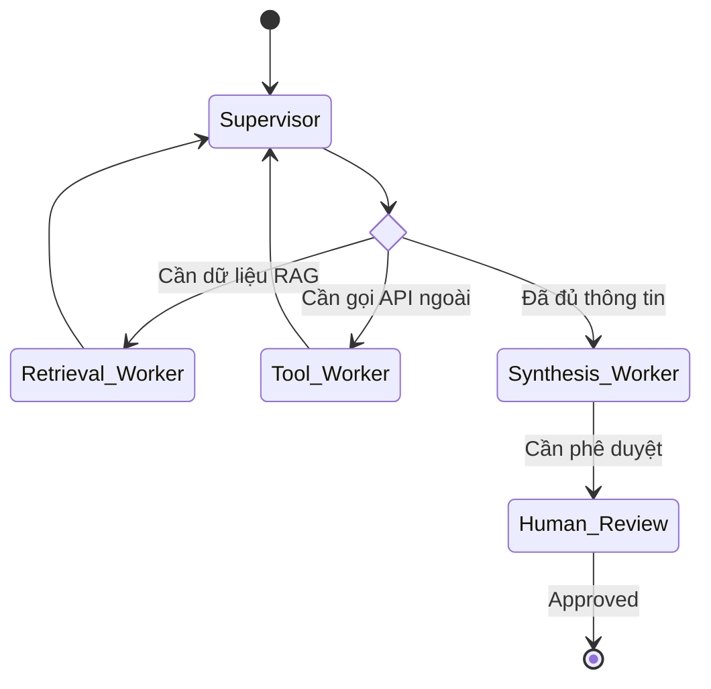

# Day 09 - Multi-Agent & System Integration

Tài liệu này hệ thống hóa toàn bộ kiến thức của **Day 09: Multi-Agent & System Integration**. Trọng tâm là phân tích các giới hạn của Single-Agent, các mẫu thiết kế Multi-Agent (đặc biệt là Supervisor-Worker), giao thức chuẩn hóa MCP & A2A, điều phối luồng chạy bằng LangGraph và cơ chế giám sát (Observability).

---

## 1. Giới Hạn Của Single-Agent & Dấu Hiệu Nâng Cấp

Một Single-Agent cố gắng ôm đồm quá nhiều việc (lên kế hoạch, tìm kiếm tài liệu, gọi API, tổng hợp kết quả) sẽ nhanh chóng chạm tới các giới hạn kỹ thuật:
1.  **Context Window Bottleneck (Nghẽn cửa sổ ngữ cảnh):** Giữ quá nhiều hướng dẫn, kết quả của nhiều lượt gọi công cụ và lịch sử chat khiến model dễ bị quá tải, gây lỗi quên thông tin ở giữa (*lost-in-the-middle*).
2.  **Specialization Trade-off (Giảm tính chuyên môn hóa):** Một prompt càng dài để dạy agent làm mọi việc thì hiệu suất thực hiện từng tác vụ nhỏ càng kém và thiếu tính ổn định.
3.  **Parallelism Hạn Chế (Thiếu khả năng chạy song song):** Single-agent thường xử lý tuần tự từng bước, tăng độ trễ (latency) không cần thiết khi có các tác vụ độc lập có thể chạy song song.
4.  **Reliability Yếu (Độ tin cậy thấp):** Nếu agent chọn sai tool hoặc hiểu sai nhiệm vụ ngay từ đầu, toàn bộ các bước sau sẽ bị đi lệch hướng mà không có cơ chế cô lập lỗi.

### Dấu hiệu nên nghĩ tới Multi-Agent:
*   Tác vụ có thể phân rã rõ ràng thành các vai trò khác nhau (ví dụ: một người tìm tài liệu, một người tính toán, một người kiểm tra chất lượng).
*   Các tác vụ có khả năng chạy song song để tối ưu tốc độ.
*   Cần khoanh vùng chính xác điểm lỗi (do người tìm tài liệu sai hay người tổng hợp viết kém).
*   Cần cắm thêm năng lực mới mà không muốn viết lại toàn bộ prompt của hệ thống.

---

## 2. 4 Multi-Agent Patterns Phổ Biến

Đội ngũ phát triển cần lựa chọn đúng pattern phù hợp với cấu trúc bài toán để tránh tạo thêm phức tạp giả:

```
[Supervisor-Worker]           [Pipeline]               [Debate]
   Supervisor                 Agent A ──> Agent B     Agent A ──┐
   ├── Worker 1                                       Agent B ──┼─> Aggregator
   └── Worker 2                                       Agent C ──┘
```

1.  **Supervisor-Worker:** Một supervisor trung tâm điều phối, phân việc cho các worker chuyên biệt và tổng hợp kết quả.
    *   *Ưu điểm:* Luồng đi rõ ràng, dễ kiểm soát, dễ cắm thêm worker mới.
2.  **Pipeline (Tuyến tính):** Output của Agent A là input trực tiếp cho Agent B.
    *   *Ưu điểm:* Flow cố định, ổn định, dễ test từng bước đơn lẻ. Nhược điểm: Latency cộng dồn lớn.
3.  **Debate (Tranh biện):** Nhiều agent độc lập cùng giải một bài toán, thảo luận phản biện chéo để thống nhất câu trả lời.
    *   *Ưu điểm:* Giảm thiểu blind spot, tăng độ chính xác. Nhược điểm: Chi phí LLM rất cao.
4.  **Hierarchical (Phân cấp):** Supervisor điều phối các nhóm supervisor nhỏ hơn. Dành cho hệ thống quy mô lớn ở doanh nghiệp (Enterprise scale).

---

## 3. Deep Dive: Supervisor-Worker Architecture

Đây là pattern thực dụng và phổ biến nhất để bắt đầu xây dựng hệ thống Multi-Agent.

### 3.1. Phân vai rõ ràng:
*   **Supervisor (Người điều phối):** Phân tích yêu cầu ban đầu $\rightarrow$ Quyết định gọi worker phù hợp $\rightarrow$ Giám sát trạng thái và thử lại (retry) khi worker fail $\rightarrow$ Tổng hợp câu trả lời cuối cùng hoặc chuyển hướng con người phê duyệt (HITL).
*   **Worker (Người thực thi):** Chuyên trách một tác vụ hẹp (ví dụ: chỉ gọi API SQL, hoặc chỉ đọc PDF). Nhận input sạch, trả output cấu trúc, hoạt động càng **stateless** (không lưu trạng thái) càng tốt để dễ viết unit test.

### 3.2. Thiết Kế Shared State Schema Tối Thiểu
Để các agent phối hợp nhịp nhàng, hệ thống cần duy trì một trạng thái dùng chung (Shared State) bao gồm các trường:
*   `task`: Nhiệm vụ gốc từ người dùng.
*   `plan`: Danh sách hoặc thứ tự các worker cần gọi.
*   `worker_results`: Từ điển lưu kết quả trả về của từng worker.
*   `status`: Trạng thái hệ thống (`pending`, `running`, `done`, `error`).
*   `final_answer`: Kết quả tổng hợp cuối cùng.
*   `trace`: Nhật ký ghi lại toàn bộ lộ trình ra quyết định của các agent (bắt buộc phải có để phục vụ observability).

---

## 4. MCP (Model Context Protocol) & A2A Communication

*   **MCP (Model Context Protocol - Giao thức ngữ cảnh mô hình):** Chuẩn kết nối duy nhất giữa Agent và các tài nguyên/công cụ bên ngoài (Database, API, File System).
    *   *Analogy:* MCP giống như **cổng USB**. Agent (Client) không cần code adapter cho từng công cụ. Chỉ cần kết nối với MCP Server, gọi lệnh `tools/list` để khám phá (Discovery) các công cụ có sẵn và `tools/call` để kích hoạt thực thi.
*   **A2A (Agent to Agent - Giao tiếp giữa các Agent):** Cơ chế để các agent trao đổi công việc với nhau. A2A yêu cầu một **Message Contract** rõ ràng gồm:
    1.  *Task:* Việc cần làm.
    2.  *Context:* Dữ liệu cần có để làm việc.
    3.  *Expected Output:* Định dạng đầu ra mong đợi (JSON schema).

---

## 5. Orchestration Với LangGraph

LangGraph là framework mạnh mẽ giúp trực quan hóa và lập trình hệ thống Multi-Agent dưới dạng một đồ thị hướng (**Directed Graph**):



*   **Nodes (Nút):** Biểu diễn các tác nhân thực thi (Supervisor, Workers, hoặc hàm xử lý).
*   **Edges (Cạnh):** Xác định luồng di chuyển của dữ liệu giữa các Node.
*   **Conditional Edges:** Logic điều hướng động dựa trên trạng thái của shared state (ví dụ: nếu `need_retrieval` là True thì đi sang `retrieval_worker`).
*   **Persistence & Interrupts (HITL):** LangGraph hỗ trợ tạm dừng (interrupt) đồ thị tại một node chỉ định (ví dụ: node giao dịch ngân hàng) để chờ con người bấm duyệt (Human approval) rồi mới chạy tiếp mà không làm mất trạng thái trước đó.

---

## 6. Observability & Debugging Trong Hệ Multi-Agent

Hệ Multi-Agent cực kỳ khó debug vì lỗi ở bước đầu tiên (ví dụ: route sai) có thể chỉ lộ ra ở kết quả cuối cùng. Hệ thống bắt buộc phải thiết kế **Trace Log** chuẩn hóa ghi nhận từng entry:
```json
{
  "timestamp": "2026-06-11T10:03:21Z",
  "agent_id": "supervisor",
  "action": "route_decision",
  "decision": "retrieval_worker",
  "reason": "need_retrieval=true",
  "status": "ok",
  "latency_ms": 312
}
```

### Độ Tin Cậy & Xử Lý Lỗi (Reliability & Fallbacks):
*   Thiết lập **Timeout** cứng cho từng worker để tránh nghẽn luồng.
*   Thiết kế **Retry logic** tại supervisor (thử lại tối đa N lần).
*   Hạ cấp có kiểm soát (**Graceful degradation**): Nếu một worker phụ thất bại, supervisor vẫn tổng hợp kết quả dựa trên các phần việc đã thành công thay vì crash toàn bộ hệ thống.
