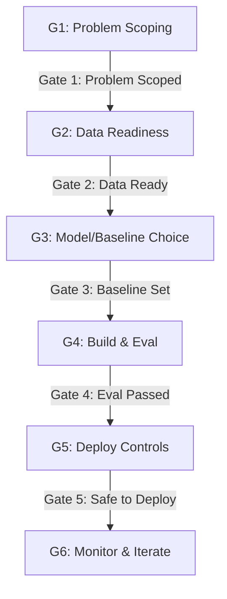

# Bản Đồ Hệ Thống Hóa Kiến Thức AI 15 Ngày (AI Application)

Tài liệu này tổng hợp toàn bộ tri thức của hành trình 15 ngày thành các sơ đồ và khung tư duy cốt lõi, giúp bạn có cái nhìn toàn cảnh từ lúc định hình bài toán kinh doanh đến khi triển khai hệ thống AI an toàn trên production.

---

## Phần 1: Khởi Tạo & Định Hình Bài Toán (Day 01 - Day 03)

### 1.1. Sơ Đồ Tiến Hóa Giải Pháp AI (AI Solution Spectrum)
Không phải bài toán nào cũng cần Agent tự trị. Chọn mức độ phù hợp để tối ưu chi phí và độ ổn định.

```text
 [ Quy tắc cứng ]     [ Dịch & Tạo sinh ]      [ Suy luận & Gọi Tool ]      [ Tự trị đa bước ]
    Rule-based    ──>     LLM Chatbot     ──>       ReAct Agent         ──>   Autonomous Agent
 
 Chi phí: Thấp            Trung bình                 Cao                       Rất cao
 Rủi ro:  Thấp            Ảo giác (Hallucinate)      Lặp vô hạn (Infinite loop) Mất kiểm soát
 Mức độ:  Phân loại, Tính AI Support, FAQ             Đặt vé, Lên kế hoạch       Nghiên cứu thị trường
```

### 1.2. 6 Cổng Duyệt Phát Triển Sản Phẩm AI (AI Product Gates)
Phát triển AI không tuyến tính mà theo các cổng kiểm định (Gates) để loại bỏ rủi ro từ sớm.


> [!NOTE]
> **Quy tắc:** Garbage In $\rightarrow$ Garbage Out. Nếu rớt ở Gate 2, phải lùi lại sửa Data, tuyệt đối không nhảy sang Gate 3 chọn model.

---

## Phần 2: Nền Tảng Kỹ Thuật Lõi (Day 04 - Day 08)

### 2.1. Cấu Trúc Lớp Của Một Lượt Gọi Model (Context Packet)
Model không chỉ nhận câu hỏi, nó xử lý toàn bộ "bàn làm việc" (Context Window).

```text
 ┌────────────────────────────────────────────────────────┐
 │                   APPLICATION HARNESS                  │
 │ (Lớp Code vận hành: Retry, Phê duyệt, Catch Error)     │
 │                                                        │
 │  ┌──────────────────────────────────────────────────┐  │
 │  │                  CONTEXT WINDOW                  │  │
 │  │  1. System Prompt (Luật, Format)                 │  │
 │  │  2. User Profile / Settings                      │  │
 │  │  3. RAG Documents (Dữ liệu nền tìm được)         │  │
 │  │  4. Conversation History (Chat trước đó)         │  │
 │  │  5. Tool Schemas (Danh sách API được phép dùng)  │  │
 │  │  6. User Query (Yêu cầu hiện tại)                │  │
 │  └──────────────────────────────────────────────────┘  │
 └────────────────────────────────────────────────────────┘
```

### 2.2. Luồng Xử Lý RAG Toàn Diện (Advanced RAG Pipeline)
Kết hợp giữa Ingestion chuẩn, Hybrid Search và Reranking để giảm thiểu Ảo giác (Hallucination).

```text
 [ Nhánh 1: Nạp Dữ Liệu - Ingestion ]
 Nguồn Thô ──> Làm Sạch (Mask PII) ──> Chia Nhỏ (Chunking) ──> Embedding ──> Vector DB (Kèm Metadata)

 [ Nhánh 2: Truy Xuất & Trả Lời - Retrieval & Generation ]
 Câu hỏi User ──> Viết lại (Rewrite)
                      │
           ┌──────────┴──────────┐
   Semantic Search        Keyword Search (BM25)
           └──────────┬──────────┘
                      ▼
               [ Reranker Model ] (Chấm điểm lại & chọn Top-K)
                      │
                      ▼
        Prompt + Context (Grounded Data)
                      │
                      ▼
               [ LLM Generation ] ──> Câu trả lời + Trích dẫn (Citations)
```

---

## Phần 3: Kiến Trúc Nâng Cao & Tích Hợp (Day 09 - Day 11)

### 3.1. Mô Hình Đa Tác Nhân (Multi-Agent: Supervisor-Worker)
Khắc phục giới hạn của Single-Agent (quá tải ngữ cảnh, giảm tính chuyên môn) bằng đồ thị LangGraph.

```text
                  [ User Request ]
                         │
                         ▼
              [ Shared State Schema ] <──────────────────────────┐
              (task, plan, worker_results, trace)                │
                         │                                       │
                         ▼                                       │
              [ Supervisor Agent ] (Điều phối)                   │
                         │                                       │
                         ▼                                       │
              < Routing Decision > (Đọc State)                   │
                         │                                       │
           ┌─────────────┼─────────────┐                         │
           ▼             ▼             ▼                         │
     [ Worker R ]   [ Worker T ]   [ Worker S ]                  │
     (Retrieval)     (Tool call)   (Synthesis)                   │
           │             │             │                         │
           ▼             ▼             ▼                         │
     (Cập nhật State, ghi Trace logs, trả kết quả) ──────────────┘
```

### 3.2. Phòng Thủ An Ninh Đa Lớp (Defense-by-Design & Guardrails)
Ngăn chặn Prompt Injection, Lộ lọt dữ liệu (PII) và Rủi ro vận hành (The Lethal Trifecta).

```text
                [ User Input ]
                       │
                       ▼
          [ Input Guardrails Pipeline ] (Lọc Topic, Phát hiện Injection)
                       │
          ┌────────────┴────────────┐
          ▼ (Bẩn)                   ▼ (Sạch)
    [ Block & Alert ]       [ XML Spotlighting ]
                                    │
                                    ▼
                       ┌────────────────────────┐
                       │  CaMeL Architecture    │
                       │  - Privileged LLM      │ ---> (Có quyền gọi Tool Nội bộ)
                       │  - Quarantined LLM     │ ---> (Chỉ đọc nội dung từ Web/Untrusted)
                       └────────────┬───────────┘
                                    │
                                    ▼
                     [ Output Guardrails Pipeline ]
                     (Grounding check, Moderation, Mask PII)
                                    │
                         ┌──────────┴──────────┐
                         ▼ (Lỗi/Risk cao)      ▼ (An toàn)
                    [ Rollback ]        [ User Receive ]
```

---

## Phần 4: Vận Hành, Đánh Giá & Mở Rộng (Day 12 - Day 15)

### 4.1. 4 Trụ Cột Của AI Observability (SRE cho AI)
Hạ tầng APM truyền thống không đủ, cần bổ sung Traces và Continuous Eval để bắt lỗi AI âm thầm (Silent failure).

```text
                  ┌─────────────────────────────────────────┐
                  │       4 Pillars of AI Observability     │
                  └────────────────────┬────────────────────┘
          ┌────────────────────────────┼────────────────────────────┐
┌─────────┴─────────┐        ┌─────────┴─────────┐        ┌─────────┴─────────┐
│      METRICS      │        │       LOGS        │        │      TRACES       │
│  "Bao nhiêu/lâu?" │        │   "Gì xảy ra?"    │        │    "Tại sao?"     │
│ (Latency, Cost)   │        │ (JSON thô, PII)   │        │ (Span tree RAG)   │
└───────────────────┘        └───────────────────┘        └───────────────────┘
                                       │
                             ┌─────────┴─────────┐
                             │  CONTINUOUS EVAL  │
                             │ "Còn đúng không?" │
                             │ (Faithfulness)    │
                             └───────────────────┘
```

### 4.2. Vòng Lặp Cải Tiến Bằng Đánh Giá (Eval-Driven Development)
Evaluation là Unit Test của AI. Dùng LLM-as-a-judge trên tập Golden Dataset để duyệt trước khi Release.

```text
 [ Cập nhật Prompt/Model ]
            │
            ▼
 [ Chạy trên Golden Dataset ] (50 - 1000 paired cases)
            │
            ▼
 [ LLM-as-a-Judge ] (Chấm điểm Faithfulness, Relevance, Precision)
            │
      ┌─────┴─────┐
      ▼           ▼
  [ Fail ]     [ Pass ]
      │           │
 (Debug 5 Whys)   ▼
      │     [ Release Gate ] ──> Đưa lên Production
      └───────────┘
```

### 4.3. Chiến Lược Tối Ưu Chi Phí & Mở Rộng Doanh Nghiệp (Cost & Scale)
Kết hợp Hybrid Deployment và định tuyến (Routing) để giảm 30-70% chi phí.

```text
                      [ LLM Request (100% Traffic) ]
                                │
                                ▼
         < 1. Semantic Cache (Redis) > ──(Hit)──> [ Trả kết quả ngay (Cost = 0) ]
                                │
                                ▼ (Miss)
         < 2. Prompt Compression / Summarization >
                                │ (Loại bỏ token thừa, nén ngữ cảnh)
                                ▼
         < 3. Model Routing Classifier >
                                │
                ┌───────────────┴───────────────┐
                ▼ (Tác vụ đơn giản - ~70%)      ▼ (Tác vụ phức tạp - ~30%)
          [ Cheap Model ]                [ Expensive Model ]
          (Haiku, GPT-4o-mini)            (Opus, GPT-4o)
                │                               │
                ▼                               ▼
     < 4. Đánh giá Volume Scale >      < Giữ API Thương mại >
      - Nếu > 1M tokens/ngày:
        -> Chuyển sang Self-hosted
        (vLLM / Triton Server)
        để tối ưu Unit Cost.
```
